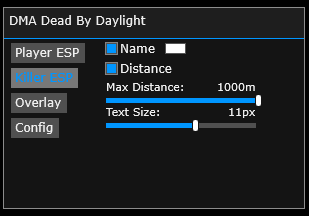
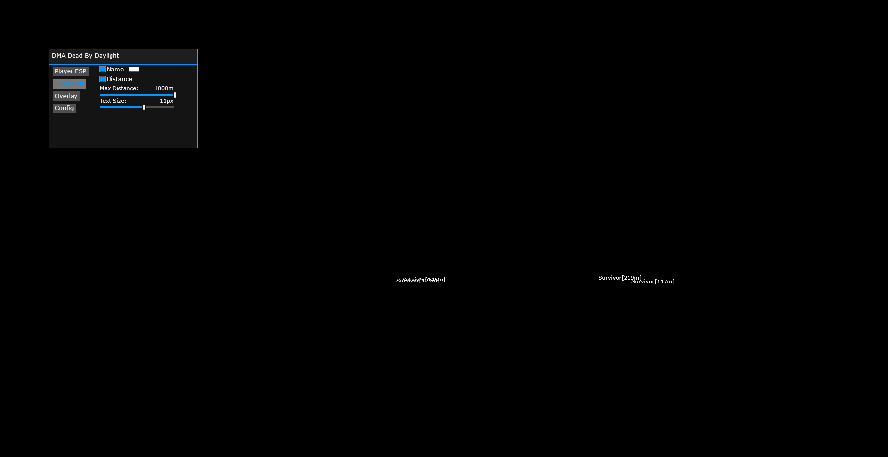
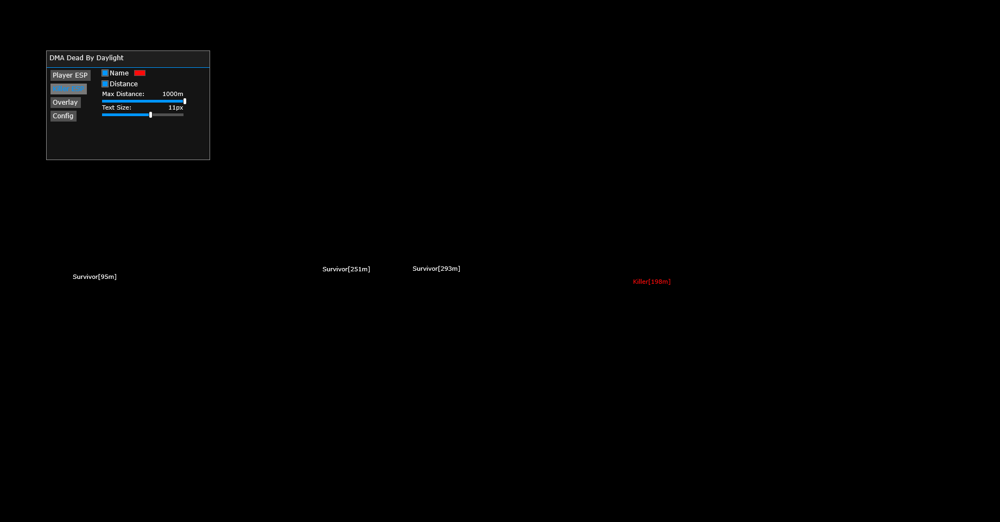
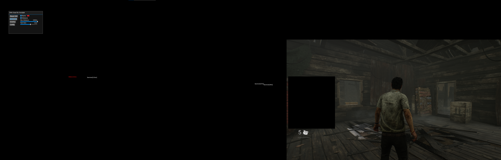

# DMAByDaylight
Simple Survivor And Killer ESP For Dead By Daylight

## Showcase

  

<a href="https://youtu.be/zNhYCNFIo1M">

  

</a>

  

  

## Instructions
* [Installation Guide](./Instructions.md)
 

To Update: Unless a major update is pushed only the GWorld will need updating which can be gotten manually or through [Dumper-7](https://github.com/Encryqed/Dumper-7). 
All the other offsets are labelled with their class name and fieldname, just search for them in an sdk dump. 

## Features
* Survivor ESP
  * Name
  * Distance
  * Font Size
  * Max Distance
* Killer ESP
  * Name
  * Distance
  * Font Size
  * Max Distance
* Overlay
  * Custom W2S Resolution
* Config
  * Load
  * Save

## Credits
* [PCILeech](https://github.com/ufrisk/pcileech)
* [MemProcFS](https://github.com/ufrisk/MemProcFS)
* [UnnamedZ03](https://github.com/UnnamedZ03/DBD-external-base)
* [DMALibrary](https://github.com/Metick/DMALibrary/tree/Master)

